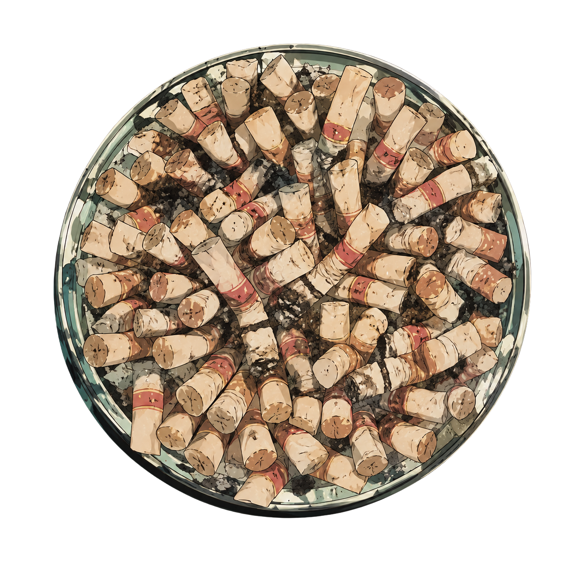

<div align="center">
  <picture>
    <source media="(prefers-color-scheme: dark)" srcset="shoko.png">
    
  </picture>

  # shoko.md

  Fine-tuning dataset quality control — deterministic checks for SFT, chat, DPO/RLHF preference pairs, classification, and prompt-completion formats.

  Run comprehensive quality control on fine-tuning datasets without relying on LLM-as-judge. Scripts compute exact facts where possible; severity and remediation priorities are interpreted through a rubric.

  **Use cases** — check, validate, audit, QC, review, vet, or sanity-check training data for SFT, instruction tuning, DPO, RLHF, or classification.
</div>

---

## Quick start

The fastest way to use shoko.md is as a Claude Code skill:

```bash
# Install with bmo
bmo add ./shoko.md.skill

# Or install directly from GitHub
bmo add github:justin06lee/shoko.md
```

Then in Claude Code:

> "QC this chat dataset before I train on it"
> "Audit this DPO preference file for bugs"
> "Validate this classification CSV"

The skill handles dataset loading, format detection, and running the right checks automatically.

---

## Skill

This project is packaged as a [Claude Code skill](https://docs.claude.com/en/docs/claude-code/skills). See `shoko.md.skill` for the distributed package or `shoko-md/` for the source.

### Eval results

The skill was benchmarked across 3 eval cases (chat QC, DPO audit, classification validation):

| Metric | With skill | Without skill | Delta |
|---|---|---|---|
| Pass rate | 89% | 22% | **+67%** |
| Time | 8.5s | 33.3s | **-24.8s** |
| Tokens | 12.5K | 20.7K | **-8.2K** |

---

## Manual install

If you prefer to install the skill without bmo:

```bash
# The .skill package is a zip archive — extract it into the skills directory
# so that ~/.claude/skills/shoko-md/SKILL.md exists.
unzip shoko.md.skill -d ~/.claude/skills/
```

Then use the same Claude Code prompts as above.

---

## Running scripts directly

You can also run the QC scripts standalone (no Claude Code needed):

```bash
# Run every check on a dataset directory
python shoko-md/scripts/run_all.py /path/to/dataset --output-dir qc-results

# With example data (has planted issues)
python shoko-md/scripts/run_all.py shoko-md/examples --output-dir qc-results --sample-size 5
```

Output: per-check JSON, stderr logs, `manual_review_samples.json`, and a consolidated `report.md`.

Or run individual scripts:

```bash
python shoko-md/scripts/split_leakage.py /path/to/dataset
python shoko-md/scripts/pii_scan.py /path/to/dataset
python shoko-md/scripts/dedup_exact.py /path/to/dataset
```

---

## Checks

| Check | What it finds | Severity range |
|---|---|---|
| `validate_schema.py` | Required fields, types, nulls, valid JSONL, empty/trivial fields | CRITICAL–OK |
| `encoding_check.py` | Mojibake, BOMs, NULL bytes | WARNING–OK |
| `dedup_exact.py` | Full-record hash duplicates | WARNING–OK |
| `dedup_near.py` | MinHash LSH near-duplicates | WARNING–OK |
| `length_stats.py` | Character/token length outliers | WARNING–OK |
| `pii_scan.py` | Emails, phone numbers, SSNs, credit cards, API keys, addresses | WARNING–OK |
| `split_leakage.py` | Cross-split exact and near-duplicate leakage | CRITICAL–OK |
| `chat_format_check.py` | Role alternation, empty assistant turns, tool call types | CRITICAL–OK |
| `preference_pair_check.py` | Chosen=rejected, conflicting prompt pairs | CRITICAL–OK |
| `classification_check.py` | Label normalization drift, class balance | WARNING–OK |
| `prompt_completion_check.py` | Empty completions, prompt copying | CRITICAL–OK |

---

## Supported input formats

`.jsonl`, `.json`, `.csv`, `.tsv`, `.parquet`, `.arrow`, and line-delimited raw text.

Auto-detected shapes: OpenAI chat, Anthropic-style chat, prompt-completion pairs, preference pairs, classification rows, and raw text.

---

## Severity rubric

- **CRITICAL** — breaks the fine-tune or produces wrong training signal
- **WARNING** — likely degrades quality; training may still run
- **INFO** — worth knowing but not necessarily actionable
- **OK** — check completed without findings

---

## Configuration

Config is auto-discovered from `.shoko.config.json` in the current directory or `~/.shoko.config.json` (local overrides global). You can also pass it explicitly:

```bash
python shoko-md/scripts/run_all.py data/ --config .shoko.config.json --output-dir qc-results
```

```json
{
  "near_duplicate_threshold": 0.85,
  "min_trivial_chars": 3,
  "declared_labels": ["negative", "neutral", "positive"],
  "max_file_size_gb": 1.0
}
```

---

## Out of scope

- Modifying or cleaning the dataset (report-only)
- LLM-as-judge response quality evaluation
- Prompt injection or jailbreak detection
- Factual correctness of completions
- Semantic alignment for prompt-completion pairs
- ML-based PII detection (regex only)
- Pretraining-scale corpora
